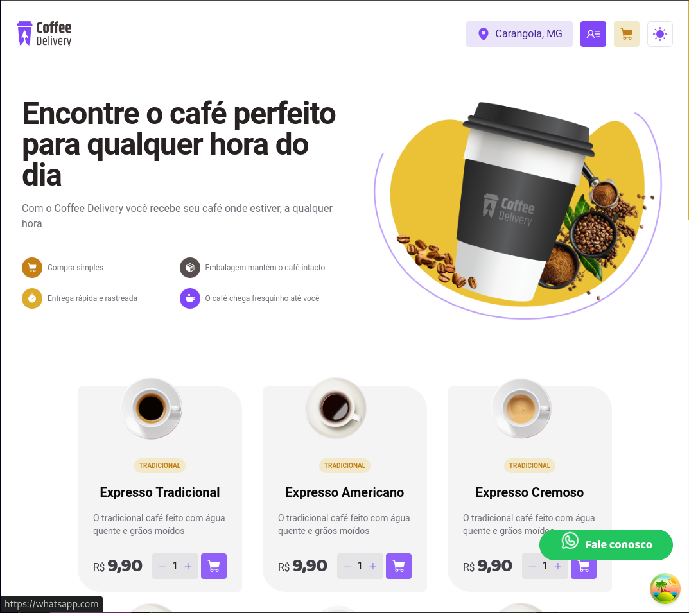
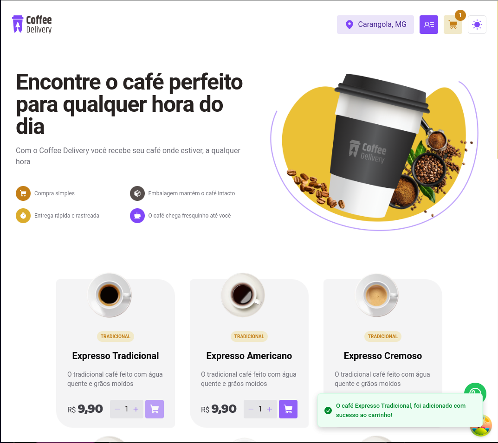
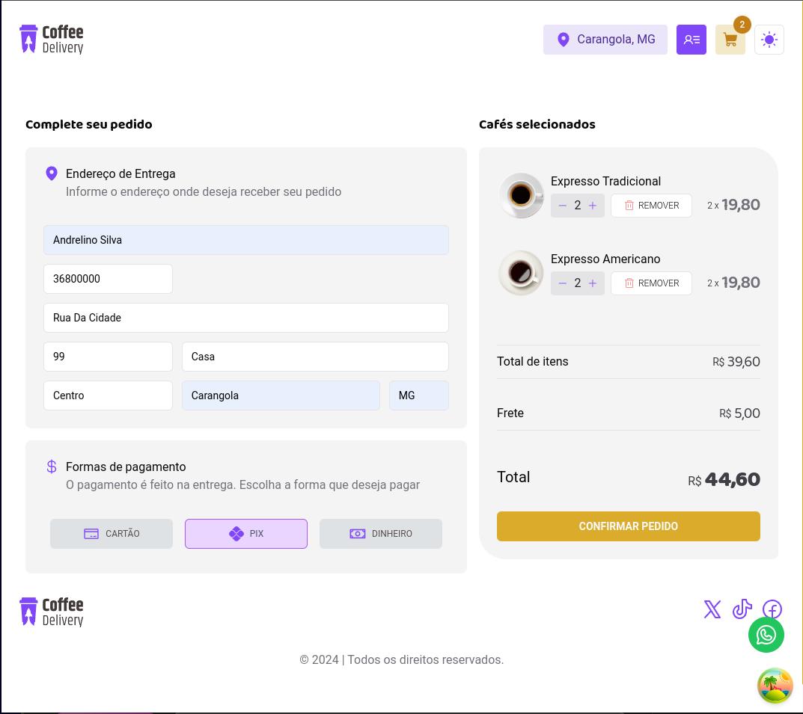
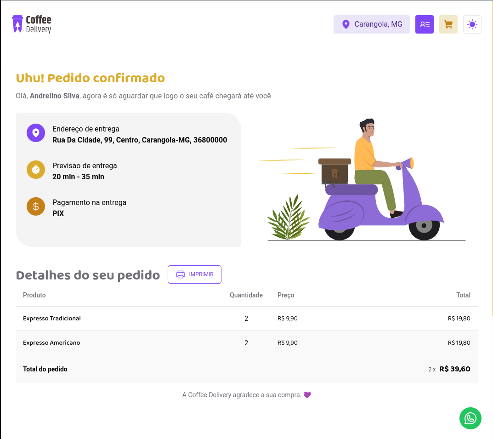
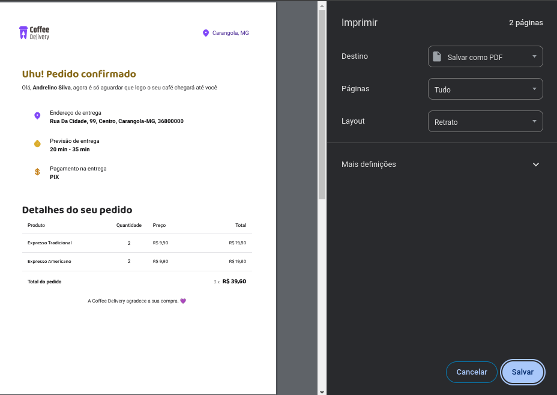
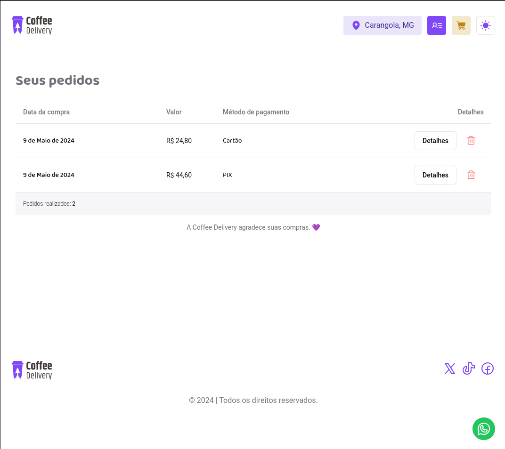
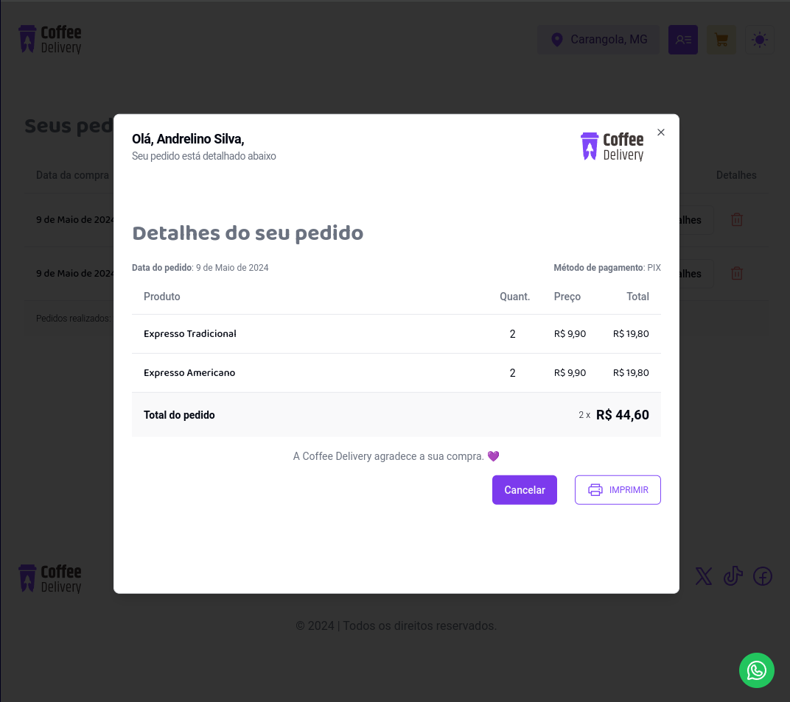
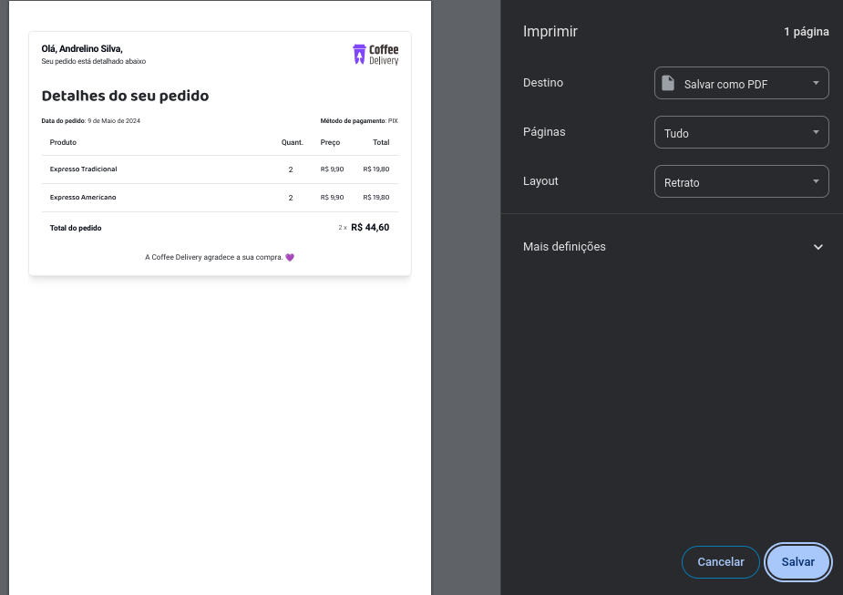

  

  &#xa0;

  <!-- <a href="https://coffeedelivery.netlify.app">Demo</a> -->

<h1 align="center">Coffee Delivery</h1>

  

  

  

  

## Descrição

O Coffee Delivery é um aplicativo para venda de cafés, proporcionando uma experiência simples e conveniente para os amantes da bebida. Com o Coffee Delivery, você pode escolher entre uma variedade de cafés deliciosos, adicionar ao carrinho, informar seus detalhes de entrega e escolher sua forma de pagamento preferida. Além disso, o aplicativo oferece recursos adicionais, como visualização de pedidos anteriores e a capacidade de imprimir recibos.

## Funcionalidades

1. **Adicionar ao Carrinho**: Explore nossa seleção de cafés e adicione facilmente seus favoritos ao carrinho de compras.

2. **Informar Nome e Endereço para Entrega**: Insira seu nome e endereço para que possamos entregar seu café fresquinho no local desejado.

3. **Escolher Forma de Pagamento**: Escolha entre as opções de pagamento disponíveis, incluindo cartão, pix ou dinheiro na entrega.

4. **Finalização do Pedido**: Confirme e finalize seu pedido para que possamos processá-lo com eficiência.

5. **Página de Visualização do Pedido**: Após a conclusão bem-sucedida do pedido, você será redirecionado para uma página de visualização onde poderá revisar os detalhes do seu pedido e imprimir um recibo, se desejar.

6. **Lista de Pedidos Anteriores**: Acesse uma página para visualizar todos os seus pedidos anteriores, com a opção de imprimir os recibos correspondentes.

7. **Apagar Pedidos Anteriores**: Se necessário, você pode remover qualquer um dos pedidos finalizados da sua lista para uma melhor organização.

## Ferramentas Utilizadas

1. **ReactJS + Vite.js**: Utilizamos o ReactJS juntamente com o Vite.js para o desenvolvimento rápido e eficiente da interface do usuário.

2. **Zustand**: O Zustand é utilizado para gerenciamento de estado, garantindo uma gestão eficaz dos dados da aplicação.

3. **Ícones do React-Icons**: Incorporamos ícones do React-Icons para uma experiência visual agradável e intuitiva.

4. **Zod**: Utilizamos o Zod para validação de dados, garantindo que as informações inseridas pelos usuários sejam consistentes e precisas.

5. **React Hook Form**: O React Hook Form é empregado para facilitar a criação e validação de formulários, proporcionando uma experiência de usuário fluida.

6. **Tailwind CSS**: Utilizamos o Tailwind CSS para estilização, permitindo uma fácil personalização e manutenção da aparência do aplicativo.

---

## Outras imagens ##

## :memo: License ##

This project is under license from MIT. For more details, see the [LICENSE](LICENSE.md) file.

Made with :heart: by <a href="https://github.com/andrelinos" target="_blank">Andrelino Silva</a>

&#xa0;

<a href="#top">Voltar ao topo</a>
